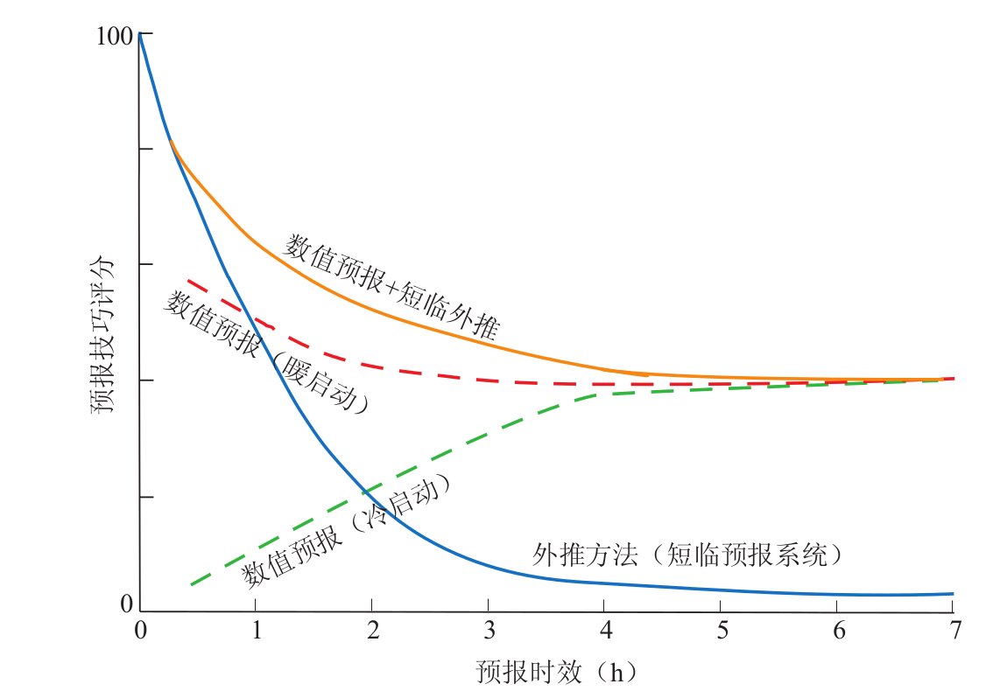

快速更新同化预报系统简介
============================

自1994年业务化以来,美国NCEP(National Centers of Environmental Prediction)的快速更新同化预报系统(Rapid Update Cycle, 简称RUC)所提供的0~12h预报已成为航空气象、强对流灾害天气等主要的中尺度预报指导产品。RUC由同化和预报两个部分构成,通过高频次的资料同化吸收最新的观测信息,不断更新模式背景场,形成更准确的初始场并进行短期预报。自业务运行以来,RUC系统进行了多次改进与升级, 新一代的快速更新同化预报系统(Repaid Refresh, 简称RR)于2012年正式业务化并取代原来的RUC系统(http://repaidrefresh.noaa.gov)。

针对强对流天气系统的0~6h预报, 各大气象研究和业务中心主要基于雷达回波与卫星图像的简单外推以及实践经验, 发展了各种类型的短时临近预报(NOWCASTING)系统, 业务应用表明它们在0~1h
的预报中相当有效。然而由于缺乏对强对流系统的发生、发展和消亡的物理机制描述, 其预报能力随预报时效增加迅速降低。如下图中的蓝线所示, 一般而言时效超过1h以上的预报可信度大大降低, 尤其是对强对流系统发展、演变的预报。采用数值模式预报强对流系统, 虽然对动力与物理过程的描述存在着各种各样的不足, 但对强对流系统活动的预报在原理上应该远优于简单的外推方法。鉴于强对流系统水平尺度较小、生命史较短的特点, 模式初始时刻对当前对流系统的准确把握是关键。传统的每6h或更长时间更新一次模式初值的数值预报系统显然不适合于短临时间尺度的预报, 因此进行较短时间间隔的高频资料同化以便初始场尽可能包含对流系统的信息就显得十分必要。美国在1991年开始研究快速更新同化技术, 并于1994年开始业务化运行。但是高频资料同化存在着模式初始变量不协调而引发的较长时间(>1h)的初始平衡问题与误差积累等问题, 它们可以大大削弱模式1~2h的预报能力, 为此所谓的热启动技术就应运而生。需要指出的是, 对于强对流天气系统的短时临近预报, 基于快速更新同化的数值预报系统与基于外推和经验的短临系统相结合(blending)是提高短时临近预报准确率的重要方向 [chenbaode2013]_。

   数值预报技术、短时临近预报技术预报技巧比较示意图

.. [chenbaode2013] 陈葆德, 王晓峰, 李泓, 张蕾 (2013): 快速更新同化预报的关键技术综述, 气象科技进展3(2), 29-35

