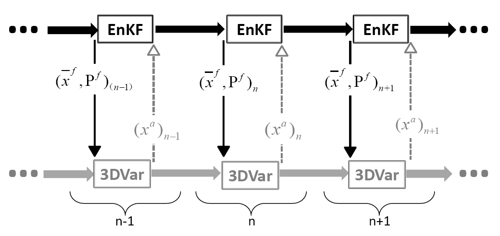

关键技术
=================

.. contents ::

绝热与非绝热数字初始化
----------------------------

由于模式本身和初始场均不是完全准确的, 模式预报不可避免地存在误差, 且预报误差随预报时效非线性增长, 资料同化的目的即是利用观测资料修正模式预报。一般天气尺度模式系统同化的频率是每6h一次, 而对流系统因其发展迅猛、生命史短、预报误差增长快等特点, 需要高频次观测资料对模式初值不断同化更新, 以得到更精准的模式初值, 继而提高预报准确率, 因此高频资料同化对强对流系统预报的好处是显而易见的。

然而, 高频资料同化也会带来一些问题。由于观测类型的不完整性及资料本身的误差, 同化后的变量之间不可避免地存在物理不平衡性, 由此激发的重力波将会导致预报误差的异常增长, 这些虚假重力波的影响在模式积分一段时间后会通过平衡调整逐渐消失, 一般将此过程称为平衡调整过程(spin-up), 所需时间称为spin-up时间。模式的预报只有在调整期后才是可信的。然而, 高频同化会不断累加、放大这种重力波的噪音效应, 使预报结果甚至差于一般同化频率的模式预报。为控制重力波噪音, 在高频同化系统中需要使用数字滤波初始化技术(digital filter initialization, DFI)来过滤掉初始场中的高频噪音(重力波)。早期的系统使用绝热的DFI即在模式预报之前对初值场进行向前和向后一段时间的绝热积分。近年来快速更新同化预报系统开始使用基于雷达反射率的非绝热DFI技术(diabatic digital filter initialization, DDFI)。DDFI与DFI的差别在于DDFI在向后一段时间积分时, 引入了由雷达反射率通过云分析所确定的潜热加热率。它的主要作用在于其可以修正初始风场, 以使得风场与初始对流活动大体上相匹配。

冷启动、暖启动和热启动技术与循环同化设计
------------------------------------------

尽量缩短spin-up时间是提高快速更新同化预报系统性能和效率的关键之一, 模式的冷启动(Cold Start)、暖启动(Warm Start)和热启动(Hot Start)技术与循环同化方案中对各种启动技术的合理配置, 都是针对如何尽量缩短spin-up时间的。模式冷启动指区域模式背景场由其他低分辨模式(如全球模式)提供, 以此为背景场做同化或直接当作初始分析场进行预报, 它的好处是可以保证模式预报不偏离大尺度背景或环境场, 但由于初始场中缺乏中尺度信息, 特别是云和水物质的特征量一般而言为零, 模式需要较长的spin-up时间。模式暖启动与热启动时, 同化背景场来自系统模式自身上一时刻的预报, 这时的背景场已包括云和水物质的特征量, 如果在同化时不进行云和水物质的调整(通常初始垂直速度也取为零), 直接进入模式的下次预报, 称为暖启动;如果在同化时通过雷达资料直接同化或使用复杂云分析对与对流系统相关的云和水物质也进行调整, 并且也调整相应的垂直速度, 使用这种初始场启动模式, 称为热启动。将各种启动方式按时间合理组合, 进行连续各时次预报就构成了循环同化预报。这里需要指出循环同化预报技术对中尺度天气的短时临近预报十分必要, 因其:1)允许高分辨模式保留模式上一循环中所发展的小尺度特征, 特别是当前观测中没有的相关垂直运动;2)维持初始场与模式物理参数化的平衡, 例如, 如果初始相对湿度与云参数化方案需要的初始云场不匹配, 模式前几小时的积分会生成过多的云和降水或者使云和降水消失。但是循环同化预报时, 高分辨预报模式会产生虚假的小尺度特征, 由于观测网通常无法解析这些小尺度特征, 也就无法在同化中使用观测来订正。这些误差有时将会被一直代入下一循环的预报, 最终使得预报大幅度偏离大尺度环境场而导致预报完全失败。为保证模式预报不偏离大尺度背景或环境场, 一段时间后模式必须进行冷启动, 而预报系统何时或多长时间进行冷启动, 依赖于实际应用经验和对大气系统的理解, 为体现完整的日变化特征, 一个冷启动到下个冷启动通常取为24h。考虑到通常夜间对流活动不活跃, 边界层相对稳定, 其选择当地的凌晨2时为冷启动时间, 每24h系统冷启动一次。

云分析技术
-----------------

在快速更新同化预报系统中, 每次模式启动时, 需要对模式初始变量(包括云、水物质含量和地表变量等)进行更新, 使模式不断吸收反映天气系统时间演变的观测信息从而达到使模式初始场更加接近实际天气状况的目的。要快速获得有关对流的信息(如云和降水), 并同化进入模式初始场中, 云分析方法(cloud analysis)是个不错的选择。国外目前在业务中使用的云分析系统包括美国空军的 CDFS-II(Cloud Depiction and Forecast System), 英国气象局的Nimrod(Nowcasting and Initialization for Modeling Using Regional Observation Data Scheme), 美国俄克拉荷马大学CAPS(Center for Analysis and Predictionof Storms)的ARPS, NOAA的LAPS(Local Analysisand Prediction System )和 RUC/RR(Rapid UpdateCycling/Rapid Refresh)。云分析方法的基本原理大体上一致, 即首先根据地面、雷达和卫星等观测资料所提供的有关云与降水信息, 结合数值预报模式结果得到云的几何特征(如云顶和云底高度, 云类型等), 然后通过对云内的温度和水汽场进行调整(如基于绝热上升的热力调整)得到云水物质参数的混合率和分布。以ARPS中ADAS云分析为例, 它首先通过地面、雷达和卫星等观测资料得到模式格点上的云量和云顶高度;然后根据三维雷达反射率资料通过Smith-Feddes模型, 并考虑干空气夹卷过程及凝结过程对云水量的损耗, 得到云水、云冰混合比;而雨水、雪、冰雹等降水粒子场则是由模式格点上的温度场和雷达反射率通过雷达反射率方程诊断分析获得;最后根据与云水、云冰对应的潜热释放, 基于湿绝热假定对云内温度场进行调整。云分析通过综合使用卫星、雷达和地面观测资料逐步完善和实现了对模式初始场的三维云特征量场的构造和修正, 同时现在的云分析方案在对云的云水、云冰特征量的分析时还分别考虑了层云与积云的不同特征, 在物理机制上的设计也更为合理。研究表明使用该方法可以缩短模式spin-up时间和提高模式中小尺度对流降水的预报效果。但是需要指出的是, 通过云分析方法得到的云水物质的混合比与模式的初始预报量(温度、湿度或者垂直速度)不平衡, 有时会造成模式的积分不稳定等问题, 这些可以通过非绝热DFI技术来解决。

近地面资料同化技术
--------------------------

近地面资料由于有较高的时空分辨率(如每小时的地面自动站2m温度和10m风观测), 它自然成为快速更新同化预报系统中, 对背景场进行快速更新同化时重要的观测资料来源。尽管各种近地面观测可以较容易得到, 但是实际上将其同化入系统并不容易, 主要原因如下:

1. 缺乏好的或合理的方法将近地面观测与大气的三维结构相关联, 因此近地面观测的作用在模式积分过程中很快就会消失;
2. 如果不进行严格的质量控制和大量的试验, 近地面观测的引入可能会破坏模式预报的边界层结构;
#. 模式地形与观测站的地形高度不一致, 可能对近地面变量特别是气温和风产生严重影响;
#. 近地面观测在某些地区分布太密集以至于观测资料的水平分辨率大于模式的分辨率, 这时可能产生模式和观测的代表性差异, 且过密的资料分布有时可能使分析太接近于观测, 如果观测质量不高且又低估了观测误差时会使得分析精度下降;
#. 同化系统中对近地面资料的观测误差取值有待改进;6)同化方案中的观测算子(如基于相似理论)尚存在较大误差。

有许多研究工作致力于解决上述问题, 如美国的RUC系统利用模式背景场提供的局地温度递减率将近地面观测资料外插到模式地表高度, 其中外插精度很大程度上取决于背景场对近地层热力稳定度的把握程度。

同化频率与资料空间分辨率
-------------------------------

快速更新同化预报系统初值的准确性还取决于资料的空间密度、资料质量及同化方法。时间上过高的同化频率会导致资料在空间分布上的不足, 继而可能对那些时空分辨率不足的观测资料同化造成负面影响。以飞机报资料为例, 其时空分辨率取决于非常不规则的飞行线路。如果同化间隔为6h, 则正负3h同化窗口内的资料空间分辨率较高, 但存在的问题是窗口内很多资料的观测时间与实际的同化时间并不一致, 对快速移动的风暴系统而言这种时间代表性误差会导致同化的失败;而当同化间隔缩小至1h, 正负半小时同化窗口内的资料时间差问题减弱, 辨率也大大降低。Benjamin等 [1] 指出, 在相同的资料量条件下, 连续高频次的低密度资料同化效果可能劣于低频次的高密度资料同化。这种时、空分辨率上的两难取舍取决于风暴的移速, 当风暴准静止时, 同化频率可取的非常低以获得空间上高密度的资料;当风暴移速较快时, 要适当增加同化频率以降低时间代表性误差, 但太高的频率又会造成资料空间代表性上的不足, 影响同化效果。

混合数据同化技术
------------------------

基于美国国家环境预报中心(NCEP)的业务快速同化循环更新预报系统(Rapid Refresh, 即RAP)以及业务高分辨率快速同化循环更新预报系统(High-Resolution Rapid Refresh，即HRRR), 针对福建以及海峡地区的天气，气候和下垫面特征，结合福建的观测资料和高性能计算资源，我们设计出一套福建高分辨率快速同化循环更新预报系统（FJ-RAP和FJ-HRRR）以满足福建短临精细化预报的服务要求。该系统采用的是目前国际上流行的混合数据同化方案，使用的是美国NCEP的业务数据同化模式GSI。

区别于传统的数据同化技术，混合同化是将变分同化和集合卡尔曼滤波有机的耦合在一起，实现他们相互间的优势互补与局限性减弱，从而可以最优化地和最大限度地使用各种现有常规和非常规气象观测数据(地面, 探空, 自动站, 风廓线, 多普勒雷达, 地基GPS-MET和卫星等). 针对不同观测数据，混合同化技术根据实时大气环流信息以及各种物理平衡条件，为短临天气预报模型提供一个最优化的初始条件，从而进一步提升模式预报结果的准确度。另外，根据观测数据的实时传输情况，混合同化技术可以将最新的数据引入预报模式，从而提供不断更新的短期临近预报结果。

对于一般的变分同化而言，其可以描述为对目标泛函 ``J`` 进行收敛，从而获得对天气预报的初试场x的最优分析。目标泛函 ``J`` 的增量（incremental）表述形式为:
 
以上方程可以转换为控制变量表述的形式, 使用:
 
同理，另外一种优化方法"集合卡曼滤波"(EnKF), 其本质上和变分方法具有一致性, 只是方式不同, EnKF使用了一个预报集合对当前大气环流场的不确定性进行显性的估计, 从而建立对背景场误差协方差矩阵的近似分析, 从而对收敛函数的下降方向给出直接迭代关系:
 
 
 
混合数据同化实际上是将变分方法和EnKF进行结合，汲取两者之长，从而解决它们自身的弱点。简而言之, 我们可以理解为将EnKF中的背景场误差协方差矩阵引入到目标泛函的收敛过程中，从而加入集合预报当前环流场信息到优化方程的收敛过程中:
 

其中Pf就来源于EnKF. 然而, 为了可以进行计算和迭代求解，我们需要对以上方程进行改写, 并引入转换项(Alpha-Control Transform):
 
这样一来经过Schur项的背景场误差协方差矩阵局地化空间分析(Covariance Localization), 目标泛函的收敛方程及变为:
 

 
   EnKF-3DVar Hybrid 混合数据同化示意图

本项目混合同化部分, 将选用美国NCEP的业务数据同化模式GSI, 主要考虑的是以下几个因素:

  1. GSI是美国海洋大气局NOAA当前稳定运行的先进业务模式，性能稳定，效果经得起考验;
  2. 在业务环境下经过多年的磨练，GSI本身对观测资料也有很完善的质量控制;
  #. GSI功能比较齐全，对几乎所有观测类型都可以同化；
  #. GSI的混合数据同化已经在全球预报（GFS）和区域高分辨率模式中（RAP和HRRR）业务化运行；
